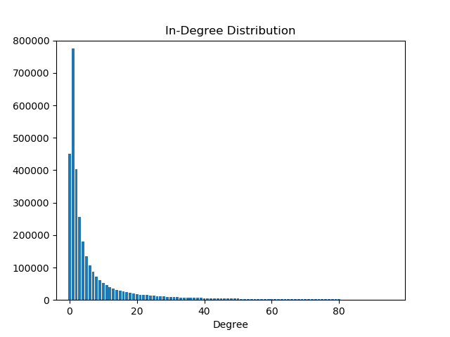
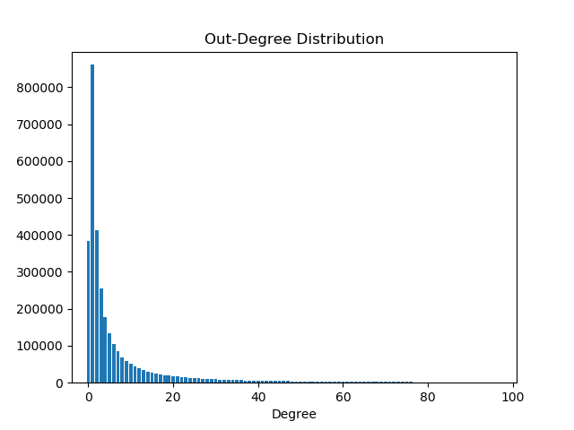
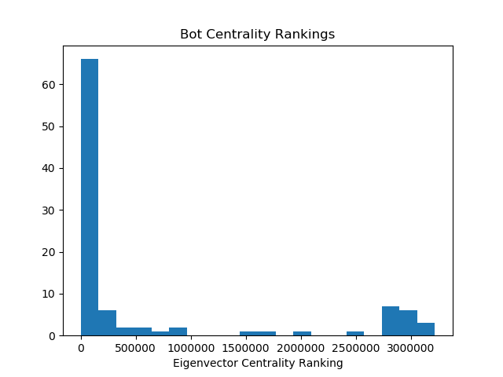
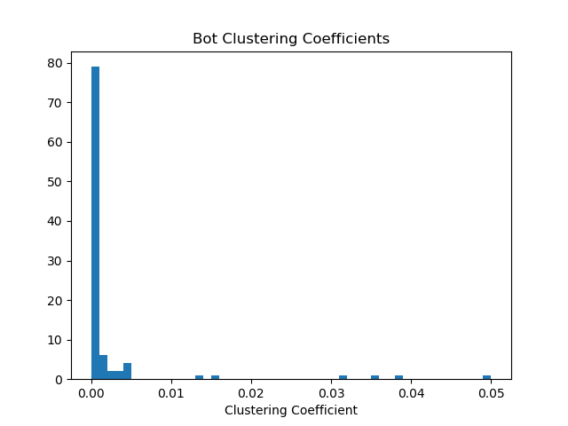
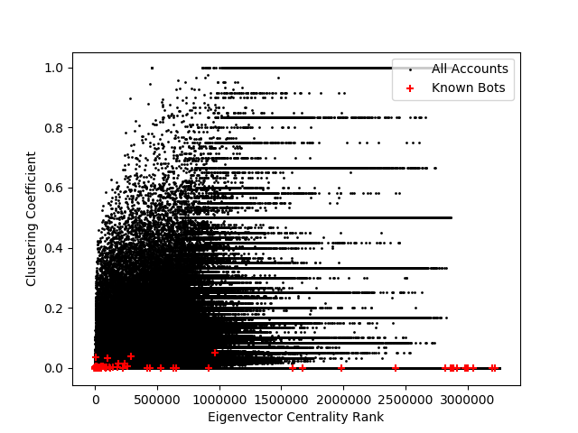

# Reddit Comment Network Analysis
#### Network analysis of reddit comments from Nov 2017, with emphasis on bot accounts.
%
%
%
%
%

### Dependencies

Python 2.7.13,BeautifulSoup,urllib2,random,time,re,os,json,numpy,pandas,matplotlib,zen

### Comment Data Set Info

Comments compiled by reddit user /u/Stuck_In_The_Matrix.

Download link: https://files.pushshift.io/reddit/comments/xz/RC_2017-11.xz

| Attribute | Value |
|-------------------|----------|
| Compressed Size | 7.6 GB |
| Uncompressed Size | 58.5 GB |
| Compression Type | xz (LZMA2) |
| Total Comments | 84,965,681 |
| Data Format | JSON |
| Deliminator | "\n" |

### Submission Data Set Info

Submissionss compiled by reddit user /u/Stuck_In_The_Matrix.

Download link: https://files.pushshift.io/reddit/submissions/RS_2017-11.bz2

| Attribute | Value |
|-------------------|----------|
| Compressed Size | 3.2 GB |
| Uncompressed Size | 22.5 GB |
| Total Submissions | 10,377,379 |
| Data Format | JSON |
| Deliminator | "\n" |
